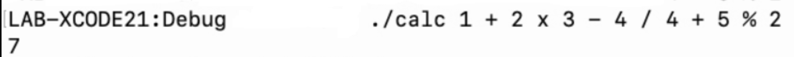

# Swift-CL-Calculator - iOS Development

A simple command-line calculator designed in Swift which utilises basic operators (+, -, *, /, %) and implements order of operations. Multiplication is input as **" x "** instead of **" * "** in the terminal.

Function limitations: no brackets, decimal values, exponentials, and unary sign operators in some cases (e.g.,  **7 / -7 = -1** but **1 + 2 * 3 / -7 = 1** which is incorrect).
For more information on functionality, refer to the [Calculator's README.md](https://github.com/Wesley-Jin/Swift-CL-Calculator/blob/main/Calculator-master/README.md).
